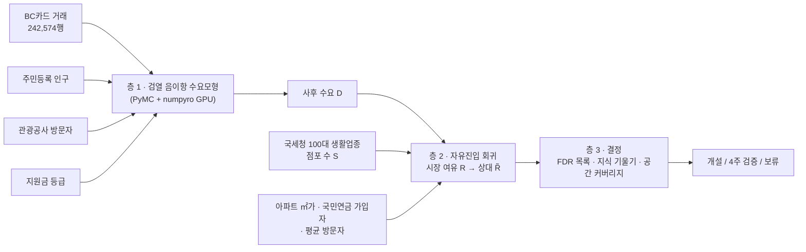

# CREDO — 불확실성 인지형 창업 입지 판단 모델

**CREDO (Confidence-Robust Demand Opportunity)** 는 BC카드 소비 데이터와 공공데이터를 결합해, 예비창업자·소상공인 지원기관에 **"어느 시군구에서 어떤 업종 점포가 부족한가"**를 알려주는 베이지안 의사결정 모델입니다. 결과는 순위표가 아니라, 불확실성을 반영한 **개설 / 4주 검증 / 보류** 판단으로 제시합니다.

- 대회: BC카드 제1회 AI금융빅데이터플랫폼 소비데이터 활용 분석·아이디어 공모전 (제출 마감 2026-09-22)
- 분석 단위: 2026년 1~6월 × 전국 255개 시군구 × 성·연령 12개 집단 × 9개 업종(수요) / 8개 업종(결정)
- 상세 방법론: 이 문서의 [4. 방법론](#4-방법론)과 [10. 의사결정 로그](#10-의사결정-로그)

> **데이터 보안 안내:** 공모전 원자료(`ABP_CONTEST_DATA.csv`)는 대회 보안서약에 따라 이 저장소에 포함하지 않습니다. 참가자는 공모전 플랫폼에서 받아 저장소 루트에 두어야 합니다. 토큰과 인증키(`.env*`)도 커밋되지 않습니다.

---

## 목차
1. [핵심 아이디어](#1-핵심-아이디어)
2. [결과 요약](#2-결과-요약)
3. [데이터](#3-데이터)
4. [방법론](#4-방법론)
5. [저장소 구조](#5-저장소-구조)
6. [설치](#6-설치)
7. [재현 절차](#7-재현-절차)
8. [산출물 설명](#8-산출물-설명)
9. [검증과 한계](#9-검증과-한계)
10. [의사결정 로그](#10-의사결정-로그)
11. [다음 작업](#11-다음-작업)
12. [팀](#12-팀)
13. [참고문헌](#13-참고문헌)

---

## 1. 핵심 아이디어

기존 카드데이터 기반 입지 추천에는 세 가지 문제가 있습니다.

| 문제 | 기존 방식 | CREDO |
|---|---|---|
| 비식별 억제 | 거래 10건 이하 셀이 사라진 데이터를 그대로 합산해 작은 시장을 왜곡 | 사라진 셀을 **"10건 이하였다"는 정보로 우도에 복원**(검열 음이항) |
| 수요 대비 공급 | 점포당 매출(균형 결과)을 미충족 수요로 오인 | 수요·비용·유입을 통제한 뒤 **점포가 적은 정도(시장 여유)**를 추정하고, 지역 안 업종끼리 비교해 BC 점유율 편향을 상쇄 |
| 불확실성 | 순위 상위 N개를 추천 | **사후기대 오탐률(FDR) ≤ 10%** 목록 + **정보가치(지식 기울기)** 로 검증 후보 선정 + **공간 커버리지** |



---

## 2. 결과 요약

### 2.1 층 1 수요모형 적합
| 항목 | 결과 |
|---|---|
| 분석 격자 | 161,136셀 (검열 5,041셀), 억제 기준 C = 10 (데이터에서 `min(cnt) − 1`로 유도) |
| 샘플링 | 4체인 × tune 3,000 / draw 4,000, numpyro (RTX A6000) |
| 수렴 진단 | **최대 R-hat 1.005, 최소 ESS bulk 592 / tail 993, divergence 0** → 통과 |
| 사후예측 구간 포함률 | 50% → 55~59%, 80% → 83~84%, **90% → 90~91%**, **95% → 93.5~94.7%** |
| 검열 보정 (실제 결측률 vs 예측) | 제과 2.7% vs 2.7%, 일식 15.6% vs 13.6%, 한식 0.6% vs 1.2% |

1차 실행(4체인 × 2,000/2,000)은 R-hat 1.023으로 기준을 넘어 폐기했습니다. 두 실행의 $\tilde R$ 상관은 1.0이고, FDR 목록 일치율은 99.8%입니다.

### 2.2 결정 결과 (`data/model/decision_table.csv`)
| 업종 | 개설(FDR ≤ 10%) | 4주 검증 | 보류 |
|---|---|---|---|
| 한식 (일반한식+갈비+한정식) | 62 | 10 | 183 |
| 중국음식 | 63 | 10 | 182 |
| 일식회집 | 67 | 10 | 178 |
| 서양음식 | 65 | 10 | 180 |
| 스넥 | 60 | 10 | 185 |
| 제과점 | 58 | 10 | 187 |
| 편의점 | 62 | 10 | 183 |
| 슈퍼마켓 | 63 | 10 | 182 |

- 4주 검증 후보는 팝업 관측 오차 가정 λ를 1/4배·4배로 바꿔도 겹침(Jaccard)이 **0.82~1.00**입니다.
- 판단표 SHA-256 앞 16자리: `d40fc74b4bd053d8` (사전 등록용, 9절)

### 2.3 공간 커버리지 (`data/model/coverage_curve.csv`)
FDR 목록 안에서 K곳을 골랐을 때 전국 양(+)의 시장 여유를 덮는 비율입니다. 괄호는 사후 90% 구간입니다.

| 업종 (커버 방식) | K = 10 | K = 20 |
|---|---|---|
| 한식 (거리 감쇠 λ = 10km) | 38.5% [32.7, 43.8] | 56.4% [49.7, 62.8] |
| 중국음식 (λ = 10km) | 37.6% [33.4, 41.9] | 55.1% [50.0, 59.9] |
| 일식회집 (λ = 10km) | 32.1% [29.5, 35.1] | 47.6% [44.4, 51.0] |
| 서양음식 (λ = 10km) | 36.5% [32.4, 41.0] | 52.0% [46.8, 57.7] |
| 스넥 (자기 지역만) | 29.6% [26.0, 33.8] | 45.9% [40.8, 51.5] |
| 제과점 (자기 지역만) | 27.4% [23.4, 31.9] | 43.7% [38.1, 50.1] |
| 편의점 (자기 지역만) | 24.1% [20.8, 27.8] | 41.6% [37.1, 46.3] |
| 슈퍼마켓 (자기 지역만) | 22.2% [19.8, 24.7] | 37.7% [34.0, 41.5] |

### 2.4 운영특성 비교 (`data/model/operating_characteristics.csv`)
같은 목록 크기에서, 사후분포를 참값으로 두고 비교했습니다(표본 내 평가).

| 규칙 | 오탐률 (FDR) | 적중률 (TPR) |
|---|---|---|
| CREDO FDR 목록 | 9.5~9.9% | 83.2~95.4% |
| $\tilde R$ 사후평균 상위 n | 9.6~9.9% | 83.2~95.3% |
| 점포당 수요 G, 지역 안 비교 | 30.3~57.8% | 42.0~66.8% |
| 점포당 수요 G | 39.9~79.5% | 21.7~55.2% |

해석: 개선은 순위 규칙이 아니라 **무엇을 추정하느냐**($\tilde R$)에서 나옵니다. CREDO의 FDR은 목록을 만들 때 건 제약을 다시 확인한 값이므로 독립적인 성능 지표가 아닙니다.

### 2.5 강건성
| 점검 | 결과 |
|---|---|
| 업종 대응표를 넓힐 때 순위 상관 (`sensitivity.csv`) | 한식 0.93, 스넥 0.78, 슈퍼 0.70, **서양 0.52** (서양은 해석 주의) |
| BC 점유율 연령 구성 편향 (`share_bias_check.csv`) | κ = +2.57, 결합 90% 구간 [1.24, 3.91]로 가설 방향 연관은 있으나 부분 R² 0.016(기준 0.05 미만) → **"이 지수로는 편향 신호가 검출되지 않음"**. 연관을 제거해도 상위 25% 목록 겹침 0.75~1.00 |
| 층 2 상권수요 λ 5·20km 민감도 (`lambda_sensitivity.csv`) | 목적형 4업종(한식·중식·일식·서양) 순위상관 0.95~0.99, 개설 목록 겹침(Jaccard) 0.82~0.93 — 주 분석(λ=10km) 대비 안정적. 신규 점포 생존 ρ: λ=5 0.064 [0.026, 0.107], λ=20 0.076 [0.040, 0.115]로 주 분석 0.075 [0.040, 0.115]와 비슷하고, 공급만 대비 구간은 λ=5 [0.033, 0.107], λ=20 [0.045, 0.118]로 둘 다 0보다 큼. 국세청 순증 기준 공급만 대비 구간은 λ=5 [0.023, 0.084]로 0보다 크고, λ=20 [−0.007, +0.056]로 0을 포함 |

### 2.6 사후 점검: 신규 점포 1년 생존 (`data/model/retro_validation.csv`)
CREDO $\tilde R$은 2024~25년 개업 점포 11.6만 곳의 2026년 6월 생존율과 업종 평균 순위상관 **0.075 [0.040, 0.115]**를 보입니다. 경쟁(공급)만 보는 기준보다 **[+0.043, +0.118]** 높습니다. 진입은 예측하지 못했습니다(9.1절).

---

## 3. 데이터

### 3.1 원본 (`data/external/raw/`, 커밋 제외)
| 파일 | 기준 | 출처 | 받는 방법 | 역할 |
|---|---|---|---|---|
| `ABP_CONTEST_DATA.csv` (저장소 루트) | 2026-01~06 | BC카드 공모전 | 참가자 전용 다운로드 | 결과변수: 거래건수 `cnt`, 금액 `amt` |
| `mois_age_population_sgg_202606.csv` | 2026-06 | [행정안전부 주민등록 인구통계](https://jumin.mois.go.kr/ageStatMonth.do) | 수동 다운로드 | 성·연령 인구 노출량 |
| `nts_100_living_industries_20260630.csv` | 2026-06-30 | [국세청 100대 생활업종](https://www.data.go.kr/data/15061118/fileData.do) | 파일 다운로드 | 공급: 업종별 사업자 수 |
| `sbiz_stores_{20230630,20240630,20250630,20260630}.zip` | 분기 | [소상공인 상가(상권)정보](https://www.data.go.kr/data/15083033/fileData.do) | 파일 + "주기성 과거 데이터" 탭 | 상권 중심점, 인천 구 분할 비율, 사후 점검(진입·생존) |
| `nps_workplaces_202607.csv` | 2026-07 | [국민연금 가입 사업장](https://www.data.go.kr/data/15083277/fileData.do) | 파일 다운로드 (CP949) | 주간 근로인구 |
| `molit_legal_dong_20260729.csv` | 2026-07-29 | [국토교통부 전국 법정동](https://www.data.go.kr/data/15063424/fileData.do) | 파일 다운로드 | 2026-07 행정구역 개편 코드 되돌림 |
| `molit_apt_trade_dev_202601_202606.csv` | 2026-01~06 계약 | 국토교통부 아파트 매매 실거래가 상세 (`RTMSDataSvcAptTradeDev`) | **스크립트(API)** | 비용 대리변수 |
| `visitkorea_locgo_visitors_20260101_20260630.csv` | 일별 | [한국관광공사 지역별 방문자수](https://www.data.go.kr/data/15101972/openapi.do) (`locgoRegnVisitrDDList`) | **스크립트(API)** | 유입 수요 |
| `kosis_household_income_sido_2025.json` | 2024 소득 | KOSIS e-지방지표 | 수동 | 검토 후 **모델 제외** (결정 5) |

### 3.2 전처리 결과 (`data/external/processed/`, 커밋 포함)
| 파일 | 행 | 내용 |
|---|---|---|
| `population_sgg_age_sex_202606.csv` | 3,060 | 255 시군구 × 성 2 × 연령 6 |
| `nts_100_living_industries_sgg_202606.csv` | 24,398 | 개편 명칭을 공모전 지역으로 되돌린 사업자 수 |
| `visitors_sgg_month_2026h1.csv` | 1,526 | 월별 현지인·외지인·외국인 방문자 (화성 4개 구 1월 없음) |
| `apt_price_sgg_2026h1.csv` | 255 | ㎡당 매매 중앙가, 거래 수 (옹진 결측) |
| `workers_sgg_202607.csv` | 255 | 국민연금 가입자 수 (1,000인 이상 사업장 제외 버전 포함) |
| `subsidy_tier_sgg_2026.csv` | 255 | 고유가 피해지원금 등급 10 / 15 / 20 / 25만원 |
| `sgg_centroids_202606.csv` | 255 | 점포 277만 개 좌표 평균(상권 중심점) |

### 3.3 결합 규칙 (요약)
1. 모든 결합은 `(SIDO_NM, CCG_NM)` 복합키로 합니다. 시군구명만으로는 233개라 255개를 구분하지 못합니다.
2. 2026-07 행정구역 개편(전남광주통합특별시, 인천 제물포·영종·서해·검단구)이 반영된 외부 자료는 공모전 지역으로 되돌립니다.
   - 인천 제물포구는 옛 동구 법정동 7개로 분할합니다(점포 비율 0.406).
   - 실거래가 API는 새 코드로 조회한 뒤 되돌립니다.
3. 결합 검사: 255개 지역 전부 존재, 사업자 합계 보존, 인천 서구 사업자 3만 이상.

---

## 4. 방법론

### 4.1 층 1 — 검열 음이항 수요모형 (`scripts/fit_demand.py`)
$$
\log p(y^*_{igbt}) = \begin{cases} \log \mathrm{NB}(y \mid \mu, \phi_b) & y \ge C+1 \\ \log \sum_{k=0}^{U} \mathrm{NB}(k \mid \mu, \phi_b) & \text{격자에 행 없음 (U = C, 한식은 3C)} \end{cases}
$$
$$
\log \mu_{igbt} = \log P_{ig} + \log n_t + \alpha_b + \gamma_{bg} + \tau_{bt} + \eta_{kt} + e_b\,\delta_{tk} + x_{it}^\top\beta_b + u_i + v_{ib}
$$
- **$\gamma, \tau, \eta, u, v$:** centered `ZeroSumNormal` 효과입니다. 데이터가 강해 non-centered 모수화는 수렴에 실패했습니다.
- **$\delta_{tk}$:** 5~6월 지원금 등급 효과입니다. $e_b = 0$인 **대형할인점이 대조군**입니다.
- **$x_{it}$:** 방문자의 지역 내 월별 편차입니다. 지역 고정 공변량은 층 2로 옮겼습니다(결정 8).
- **산출:** $D_{ib} = \sum_{g,t} \mu_{igbt}$ 사후 draw 1,000개입니다.

### 4.2 층 2 — 시장 여유 (`scripts/decide.py`, 결정 10)
$$
\log E[S_{ib}] = a_b + \psi_b \log D^{c}_{ib} + w_i^\top\rho_b,\qquad D^{c}_{ib} = \sum_j e^{-d_{ij}/\lambda} D_{jb}\ (\text{목적형}),\ \ D_{ib}\ (\text{근린형})
$$
$$
R_{ib} = \log \hat S_{ib} - \log(S_{ib}+0.5),\qquad \tilde R_{ib} = R_{ib} - \tfrac18\sum_{b'} R_{ib'}
$$
- **$S$:** 국세청 사업자 수(업종 대응은 결정 3)입니다. 계수 자료라 **포아송 회귀**를 쓰고, 피어슨 산포로 공분산을 키웁니다(준포아송).
- **$D^c$:** 한식·중식·일식·서양은 λ = 10km 거리 감쇠 **상권수요**, 편의점·슈퍼·제과·스넥은 자기 지역 수요입니다.
- **$w_i$:** log 아파트 ㎡가, log 국민연금 가입자, log 평균 외지인·외국인 방문자입니다.
- **기존 지표와의 관계:** 기존 "점포당 수요" $G = \log D - \log(S+1)$은 $\psi_b = 1$, 비용·유입 통제 없음인 특수해입니다.
- **$\tilde R$:** 지역 안 업종 평균을 빼서, 지역마다 다른 BC 점유율의 영향을 상쇄합니다(결정 4).
- **추정:** 사후 draw마다 β를 근사 사후분포에서 한 번 추출해 층 1 불확실성을 전파합니다(2단계).

### 4.3 층 3 — 결정
| 단계 | 식 | 근거 |
|---|---|---|
| 순위 기준선 | $r_\gamma = \bar G_b^{-1}(0.75)$, $v_{ib} = \Pr(\tilde R_{ib} > r_\gamma)$ | Shen & Louis (1998), Lin et al. (2006) |
| 개설 목록 | $\max D : \frac1D\sum_{k\le D}(1 - v_{(k)}) \le 0.10$ | Müller et al. (2004) |
| 4주 검증 | $\nu = \tilde\sigma\,f(-\lvert\mu - r_\gamma\rvert/\tilde\sigma)$, $\tilde\sigma = \sigma^2/\sqrt{\sigma^2+\lambda}$, 업종당 10곳 | Frazier, Powell & Dayanik (2008) |
| 공간 커버리지 | $\max_{\lvert X\rvert=K}\ \mathbb E\big[\sum_j \tilde R^+_j \max_{i\in X} c_{ij}\big]$ | 근린형은 자기 지역만, 목적형은 $e^{-d/10\text{km}}$. 탐욕법 $(1-1/e)$ 근사 |

---

## 5. 저장소 구조
```
finance-modeling/
├── README.md
├── pyproject.toml · uv.lock          # Python 3.13, uv 환경
├── scripts/
│   ├── fetch_external.py             # 외부 데이터 수집·전처리 (API 비동기, 코드 되돌림)
│   ├── fit_demand.py                 # 층 1 검열 음이항 (GPU)
│   ├── decide.py                     # 층 2·3: R̃, FDR 목록, 지식 기울기, 커버리지
│   ├── operating_characteristics.py  # 운영특성 비교
│   ├── check_share_bias.py           # BC 점유율 연령 구성 편향 점검
│   ├── retro_validation.py           # 사후 점검: 순증·진입률·신규 점포 생존
│   └── make_report.py                # 제출 보고서 PDF 생성
├── notebooks/
│   ├── 01_eda_and_bayesian_opportunity.ipynb   # EDA + 객단가 모형 (수렴 진단 통과본)
│   ├── 02_external_data_acquisition_and_preprocessing.ipynb  # 인구·국세청·상가정보 전처리
│   └── 03_income_covariate_preprocessing.ipynb # KOSIS 소득 (모델 제외, 기록용)
├── data/
│   ├── external/raw/        # 원본 (커밋 제외)
│   ├── external/processed/  # 전처리 결과 (커밋)
│   └── model/               # 적합·결정 산출물 (커밋 제외, 재생성)
└── reports/                 # 제출 보고서 CREDO_report.pdf, 그림, 초기 기획서 초안
```

---

## 6. 설치

```bash
# 1) uv 설치 후 의존성 동기화 (Python 3.13)
uv sync

# 2) GPU 확인 (JAX CUDA 12)
uv run python -c "import jax; print(jax.devices())"
```

- **하드웨어:** NVIDIA GPU를 권장합니다. 층 1 본 적합은 RTX A6000 기준 약 2~3시간입니다. CPU 백엔드는 기울기 계산 1회에 약 1초라 사실상 불가능합니다.
- **`.env`** (커밋 제외):
  ```
  api_key = <공공데이터포털 인증키>
  ```
  공공데이터포털에서 **아파트 매매 실거래가 상세**와 **한국관광공사 빅데이터 지역별 방문자수**를 활용신청해야 합니다.

---

## 7. 재현 절차

| 단계 | 명령 | 소요 | 산출 |
|---|---|---|---|
| 0 | 원본 파일을 3.1절 표대로 `data/external/raw/`에, 공모전 CSV를 루트에 둡니다 | — | — |
| 1 | `uv run jupyter nbconvert --to notebook --execute --inplace notebooks/02_external_data_acquisition_and_preprocessing.ipynb` | 약 15초 | 인구·국세청 전처리 |
| 2 | `uv run python scripts/fetch_external.py` (단계 지정: `subsidy trades visitors workers centroids`) | 약 5분 (실거래가 API 약 3.5분) | 지원금·아파트가·방문자·근로인구·중심점 |
| 3 | `CUDA_VISIBLE_DEVICES=0 uv run python scripts/fit_demand.py --chains 4 --tune 3000 --draws 4000` | 약 2~3시간 | `posterior.npz`, `log_demand.npz`, `diagnostics.csv`, `calibration.csv` |
| 4 | `uv run python scripts/decide.py` | 약 1분 | `decision_table.csv` 외 5종 |
| 5 | `uv run python scripts/operating_characteristics.py` | 수 초 | `operating_characteristics.csv` |
| 6 | `uv run python scripts/check_share_bias.py` | 수십 초 이내 | `share_bias_check.csv` |
| 7 | `uv run python scripts/retro_validation.py` | 약 1분 | `retro_validation.csv` (상가정보 2023~2026 분기 파일 필요) |
| 8 | `uv run python scripts/make_report.py` | 수 초 | `reports/CREDO_report.pdf`, `reports/figures/*.png` (LibreOffice, 나눔고딕 필요) |

**안전장치:**
- 모든 스크립트는 시작할 때 `selftest()`(assert 기반)를 실행합니다.
- `fit_demand.py`는 진단 기준(R-hat < 1.01, ESS ≥ 400, divergence 0)을 넘지 못하면 `passed=False`를 기록합니다. 이 경우 `decide.py`는 실행을 거부합니다. 코드 점검 목적이라면 `--allow-unconverged`로 우회할 수 있습니다.
- `fetch_external.py`는 행정구역 되돌림 누락, 가입자 미결합 0.1% 초과, 화성 신설 구 외 일자 누락이 있으면 중단합니다.

---

## 8. 산출물 설명

### `data/model/decision_table.csv` (255 지역 × 8 업종)
| 열 | 뜻 |
|---|---|
| `SIDO_NM`, `CCG_NM` | 공모전 지역 |
| `b` | 업종: `H` 한식(8001+8002+8003), `8005` 중국음식, `8004` 일식회집, `8006` 서양음식, `8021` 스넥, `8301` 제과점, `4010` 편의점, `4020` 슈퍼마켓 |
| `R_rel_mean`, `R_rel_q05`, `R_rel_q95` | 상대 시장 여유 $\tilde R$ 사후평균과 90% 구간 (양수 = 같은 지역 다른 업종보다 점포가 부족) |
| `v_top25` | 업종 상위 25% 기준선을 넘을 사후확률 |
| `immediate_fdr10` | FDR 10% 개설 목록 포함 여부 |
| `rank_q05`, `rank_q95` | 업종 내 순위 90% 구간 |
| `R_abs_mean_reference` | 절대 시장 여유 (BC 점유율 교란 가능, 참고용) |
| `kg_value` | 4주 검증의 정보가치 $\nu$ |
| `action` | `immediate` / `pilot` / `hold` |

### 기타
| 파일 | 내용 |
|---|---|
| `coverage_curve.csv` | 업종·λ·K별 선택 지역 순서와 커버 비율(평균, 90% 구간) |
| `sensitivity.csv` | 넓힌 업종 대응표 대비 순위 상관·상위 25% Jaccard·FDR 목록 Jaccard |
| `lambda_sensitivity.csv` | 목적형 4업종 × 거리 감쇠 λ(5, 20km)별, 주 분석(λ=10km) 대비 순위상관·상위 25%/개설 목록 Jaccard, 즉시 목록 수 |
| `pilot_sensitivity.csv` | λ 배수(0.25, 4)별 검증 후보 겹침 |
| `operating_characteristics.csv` | 4개 규칙의 FDR·TPR (같은 목록 크기) |
| `share_bias_check.csv` | 업종 고령 기울기와 민감도 점검 결과 |
| `r_rel_draws.npz` | $\tilde R$ 사후 draw (1000 × 255 × 8), FDR 목록, 기준선 |
| `diagnostics.csv`, `calibration.csv` | 층 1 파라미터별 R-hat·ESS, 업종별 검열 보정·구간 포함률 |
| `retro_validation.csv` | 결과변수(순증·진입률 3개 기간·생존) × 예측변수(공급만·G·R̃, λ 5·20km 대안 R̃ 포함)별 순위상관, 부트스트랩 구간, 공급만 대비 차이 |

---

## 9. 검증과 한계

### 9.1 사후 점검 (점포 변화, `scripts/retro_validation.py`)
"시장 여유가 큰 곳에서 점포가 더 늘거나 오래 살아남는가"를 과거 자료로 점검했습니다. 수치는 업종 평균 순위상관이고, 괄호는 지역 군집 부트스트랩 90% 구간입니다.

| 결과변수 | 공급만 (−log S) | 점포당 수요 G | CREDO $\tilde R$ | $\tilde R$ − 공급만 |
|---|---|---|---|---|
| 국세청 1년 순증 (2025-06→2026-06) | 0.148 [0.106, 0.186] | 0.177 [0.135, 0.213] | 0.182 [0.144, 0.221] | [+0.004, +0.067] |
| 상가정보 진입률 2023-06→2024-06 | −0.036 | −0.107 | −0.093 | [−0.091, −0.024] |
| 상가정보 진입률 2024-06→2025-06 | 0.028 | −0.045 | −0.033 | [−0.095, −0.026] |
| 상가정보 진입률 2025-06→2026-06 | 0.051 [0.007, 0.096] | 0.001 | 0.034 [−0.009, 0.083] | [−0.049, +0.016] |
| **신규 점포 1년 생존율** (2024~25 개업 11.6만 곳 → 2026-06) | −0.007 [−0.048, 0.036] | 0.037 [−0.006, 0.080] | **0.075 [0.040, 0.115]** | **[+0.043, +0.118]** |

- **국세청 순증과의 상관은 대부분 평균회귀입니다.** 수요 정보가 없는 "공급만" 기준도 0.148이 나옵니다.
- **진입은 예측하지 못합니다.** 어느 기간에서도 공급 평균회귀를 넘는 진입 예측력은 확인되지 않았습니다.
- **신규 점포 생존**은 수요 시점과 생존 시점이 같아 시간 순서가 맞는 검증입니다. 결정 10 모형의 $\tilde R$만 구간이 0보다 크고, 경쟁만 보는 기준보다도 유의하게 높습니다. 업종별로는 중식 0.21, 일식 0.18이 가장 강합니다. 효과 크기는 작습니다.
- 따라서 CREDO는 "진입 예측기"가 아니라 **생존 관점의 입지 위험 선별 도구**로 위치시킵니다. 현재 판단표(SHA-256 `d40fc74b4bd053d8…`)는 국세청 2026-07·08, 상가정보 2026-09 자료로 검증하도록 사전 등록합니다.
- **모형 선택 순서:** 결정 10은 생존 점검 전에 정했습니다. 다만 그 전에 국세청 순증으로 여러 변형(포아송, 매출 기준, 상권수요 등)의 점수를 비교했습니다. 점수 1위(목적형 상권수요 단독)가 아니라 계수 자료와 결정 9 공간 가정에 맞는 "포아송 + 목적형 상권수요"를 골랐습니다. 지역 절반 분할 200회 점검에서는 점수로 고른 변형과 채택안의 표본 밖 차이가 확인되지 않았습니다(−0.002, 90% 구간 [−0.029, +0.016]; 국세청 순증 기준 탐색 단계 점검이며 재현 스크립트는 저장소에 없습니다).

### 9.2 알려진 한계
- BC카드 관측 수요이지 전체 시장 매출이 아닙니다. 우리카드 독자망 이탈로 기간 중 BC망 점유율이 떨어졌습니다(여신금융협회 월별 실적 기준 추정 10.4% → 9.6%). 지역·업종별 점유율 차이는 $\tilde R$로 일부만 상쇄됩니다.
- 지역 기준(가맹점 소재지)과 억제 기준(≤ 10건)은 공식 코드북이 아니라 데이터로 추정했습니다.
- 업종 대응표(BC 업종 ↔ 국세청 업종)는 서양음식에서 불확실합니다(순위 상관 0.52).
- 층 2는 6개월 횡단면이고 동시추정이 아닙니다(2단계). 점포 수 $S$의 내생성이 남습니다.
- 연령 구성 편향 점검에서 가설 방향 연관(κ > 0)이 있으나 설명력이 작습니다(부분 R² 1.6%). 다른 경로의 점유율 편향은 배제하지 못했습니다.

---

## 10. 의사결정 로그

| # | 결정 |
|---|---|
| 1 | 억제 기준 C는 데이터에서 `min(cnt) − 1`로 유도하고, 업종·성별·월 축별 최솟값 검사로 고정 |
| 2 | 한정식·갈비는 한식으로 셀 합산(편향 ≤ 2C, 결측 상한 3C). 대형할인점은 존재 조건부 수요 + 지원금 대조군. 나머지 결측은 검열 |
| 3 | 공급 대응은 이름 기준 1:1. 넓힌 정의는 민감도 분석으로만 |
| 4 | 결정 지표는 지역 안 업종 간 상대 시장 여유 $\tilde R$ (BC 점유율 편향 상쇄). 절대 R은 참고용 |
| 5 | KOSIS 시도 가구소득은 모델에서 제외(설명력 0.1~5.6%, 소득연도 2024) |
| 6 | 근로인구 = 국민연금 가입자수 (SGIS 사업체통계는 2019년까지라 기각) |
| 7 | 계층 효과는 centered ZeroSumNormal + numpyro GPU |
| 8 | 지역 고정 공변량은 층 2로. 층 1에는 방문자 월별 편차만 |
| 9 | 공간 커버리지: 근린형은 자기 지역만, 목적형은 거리 감쇠 λ = 10km (5·20km 민감도) |
| 10 | 층 2를 준포아송 회귀 + 목적형 상권수요로 변경(생존 점검 전 확정, 근거는 계수 자료·결정 9). 검증은 신규 점포 생존 중심, 층 2 λ 5·20km 민감도 추가 — **구현 완료** |

---

## 11. 다음 작업
- [x] 결정 10 구현: 층 2를 준포아송 회귀 + 목적형 상권수요로 바꾸고 FDR 목록·커버리지·운영특성 재계산
- [x] 사후 점검 정식 스크립트: 국세청 순증, 진입률(3개 기간), 신규 점포 생존율
- [x] 제출 보고서 초안: `reports/CREDO_report.pdf` (`scripts/make_report.py`로 재생성)
- [ ] 사전 등록 검증: 국세청 2026-07·08, 상가정보 2026-09 공개 후 개설 후보 vs 비후보 생존·진입 비교

---

## 12. 팀
| GitHub |
|---|
| [@zongseung](https://github.com/zongseung) |
| [@wnddnr0914](https://github.com/wnddnr0914) |
| [@rahyeon9978-wq](https://github.com/rahyeon9978-wq) |
| [@millet-birb](https://github.com/millet-birb) |

---

## 13. 참고문헌
- Müller, P., Parmigiani, G., Robert, C., Rousseau, J. (2004). Optimal sample size for multiple testing. *JASA* 99:990–1001.
- Shen, W., Louis, T. A. (1998). Triple-goal estimates in two-stage hierarchical models. *JRSS-B* 60:455–471.
- Lin, R., Louis, T. A., Paddock, S. M., Ridgeway, G. (2006). Loss function based ranking in two-stage hierarchical models. *Bayesian Analysis* 1:915–946.
- Frazier, P. I., Powell, W. B., Dayanik, S. (2008). A knowledge-gradient policy for sequential information collection. *SIAM J. Control Optim.* 47:2410–2439.
- Berry, S., Waldfogel, J. (1999). Free entry and social inefficiency in radio broadcasting. *RAND J. Econ.* 30:397–420.
- Schaumans, C., Verboven, F. (2015). Entry and competition in differentiated products markets. *REStat* 97:195–209.
- Carree, M., Dejardin, M. (2007). *Small Business Economics* 29(1):203–212. doi:10.1007/s11187-006-6860-9
- Quick, H. (2019). *Preventing Chronic Disease* 16. doi:10.5888/pcd16.180441 (억제된 소지역 카운트의 베이지안 처리)

**라이선스:** 코드 라이선스는 아직 정하지 않았습니다. 공공데이터는 각 제공기관의 이용허락범위를 따르고, 공모전 데이터는 대회 규정에 따라 재배포하지 않습니다.
